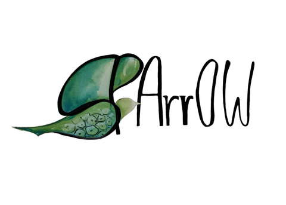

<!-- These badges won't work while the GitHub repo is private:
[](https://github.com/saeyslab/harpy/raw/main/LICENSE)
[](https://python.org)
[](https://codecov.io/gh/saeyslab/harpy)
[](https://napari-hub.org/plugins/harpy)
-->

# **Harpy: single-cell spatial proteomics analysis that makes you happy** 

[](https://pypi.org/project/harpy-analysis)
[](https://github.com//saeyslab/harpy/actions/)
[](https://harpy.readthedocs.io/en/latest/)

Note: This package is still under very active development.

## Installation

**Recommended** for end-users. Install the latest `harpy-analysis` [PyPI package](https://pypi.org/project/harpy-analysis) with the `extra` dependencies in a local Python environment. Note that the `cellpose` package is pinned to version 3. The recent Version 4 is compatible, but does not align yet with the current documentation.

```bash
uv venv --python=3.12 # set python version
source .venv/bin/activate # activate the virtual environment
uv pip install 'harpy-analysis[extra]' 'cellpose==3.1.1.2' # use uv to pip install dependencies and pin cellpose
python -c 'import harpy; print(harpy.__version__)' # check if the package is installed
```

**Only for developers.** Clone this repository locally, install the `.[dev]` instead of the `[extra]` dependencies and read the contribution guide.

```bash
# Clone repository from GitHub
uv venv --python=3.12 # set python version
source .venv/bin/activate # activate the virtual environment
uv pip install -e '.[dev]' 'cellpose==3.1.1.2' # use uv to pip install dependencies and pin cellpose
python -c 'import harpy; print(harpy.__version__)' # check if the package is installed
# make changes
python -m pytest # run the tests
```

Checkout the docs for more [installation instructions](https://github.com/saeyslab/harpy/blob/main/docs/installation.md).

## Tutorials

Tutorials are available [here](https://harpy.readthedocs.io/en/latest/).

## Usage

[Learn](https://github.com/saeyslab/harpy/blob/main/docs/usage.md) how Harpy can be integrated into your workflow in different ways.

## Contributing

See [here](https://github.com/saeyslab/harpy/blob/main/docs/contributing.md) for info on how to contribute to Harpy.

## References

- https://github.com/ashleve/lightning-hydra-template

## License

Check the [license](https://github.com/saeyslab/harpy/blob/main/LICENSE). Harpy is free for academic usage.
For commercial usage, please contact Saeyslab.

## Issues

If you encounter any problems, please [file an issue] along with a detailed description.

[napari]: https://github.com/napari/napari
[Cookiecutter]: https://github.com/audreyr/cookiecutter
[BSD-3]: http://opensource.org/licenses/BSD-3-Clause
[cookiecutter-napari-plugin]: https://github.com/napari/cookiecutter-napari-plugin
[file an issue]: https://github.com/saeyslab/harpy/issues
[napari]: https://github.com/napari/napari
[tox]: https://tox.readthedocs.io/en/latest/
[pip]: https://pypi.org/project/pip/
[PyPI]: https://pypi.org/
